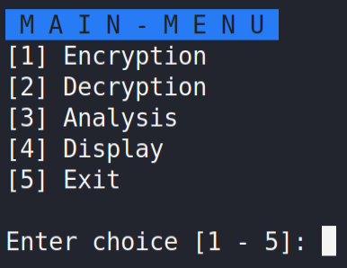

# Computer Security

A program that performs the following functions:

* Shift cipher encryption
* Shift cipher decryption
* Frequency analysis
* Display content

## Getting Started

### Prerequisites

```
Kali Linux
Bash (5.0.16(1)-release)
```

### Deployment

Clone the project on Kali Linux environment and run:

```
./main.sh
```

## Built With

* [Bash](https://www.gnu.org/software/bash/) - The programming language used

## Screenshots

Start screen:



## Authors

* **John Escobia**

## Development Duration

May 26, 2020 - May 31, 2020.
